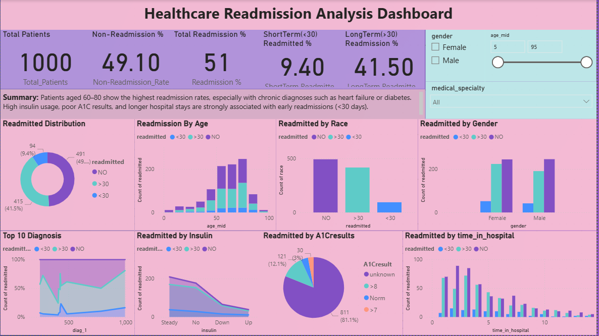

# HealthCare Readmission Analysis — End-to-End Project

This end-to-end data analytics project analyzes patient readmission patterns in a healthcare system using **MySQL**, **Python**, and **Power BI**. It identifies key clinical and demographic factors that contribute to readmissions, and builds a professional dashboard to support data-driven healthcare decisions.

---

## Project Overview

**Objective:**  
To uncover actionable insights related to hospital readmissions by analyzing patient-level data such as diagnoses, treatment patterns, and hospital stays.

**Tech Stack:**  
- **MySQL**: Data schema creation, query processing, and storage  
- **Python**: Data cleaning, feature engineering, and exploratory data analysis  
- **Power BI**: Dashboard creation and visual analytics  
- **DAX**: KPI calculations and logic for Power BI

---

## SQL Files

The following SQL files contain the full schema and data exported from the `healthcare_readmission_project` MySQL database:

- [Download diabetic_data.sql](https://raw.githubusercontent.com/RAVELLANAGARJUNA/HealthCare-Readmission-Analysis-end-to-end-project/main/SQL_Queries/diabetic_data.sql)
- [Download cleaned_patient_data.sql](https://raw.githubusercontent.com/RAVELLANAGARJUNA/HealthCare-Readmission-Analysis-end-to-end-project/main/SQL_Queries/cleaned_patient_data.sql)

> Right-click the links above and choose **“Save As”** to download and open in MySQL Workbench or any SQL editor.

---

## Dashboard Preview

---

## Key Metrics and Features

- Total number of patients
- Readmission rate (%)
- Short-term vs. long-term readmissions
- A1C result analysis
- Insulin usage and diabetesMed impact
- Diagnoses leading to higher readmissions
- Age, gender, and race distribution analysis

---

## Summary Insights

- Patients aged **60 to 80** have the highest readmission rates
- Diagnoses related to diabetes and heart conditions are leading contributors
- **High insulin usage**, poor **A1C control**, and **longer hospital stays** are key risk factors
- Power BI dashboard enables interactive filtering and real-time drill-down

---

## About Me

**R. Nagarjuna**  
Data Analyst | Python | SQL | Power BI | Excel  
📧 Email: arjunravella108@gmail.com  
🔗 LinkedIn: [linkedin.com/in/R-Nagarjuna](https://www.linkedin.com/in/R-Nagarjuna)

---

## How to Run This Project

1. Download both `.sql` files from the links above
2. Import them into your MySQL server
3. Use `cleaned_patient_data` for Power BI connection
4. Open the Power BI file (`.pbix`) to explore the dashboard

---

## License

This project is provided for educational and portfolio purposes. You're free to reference or reuse with attribution.

